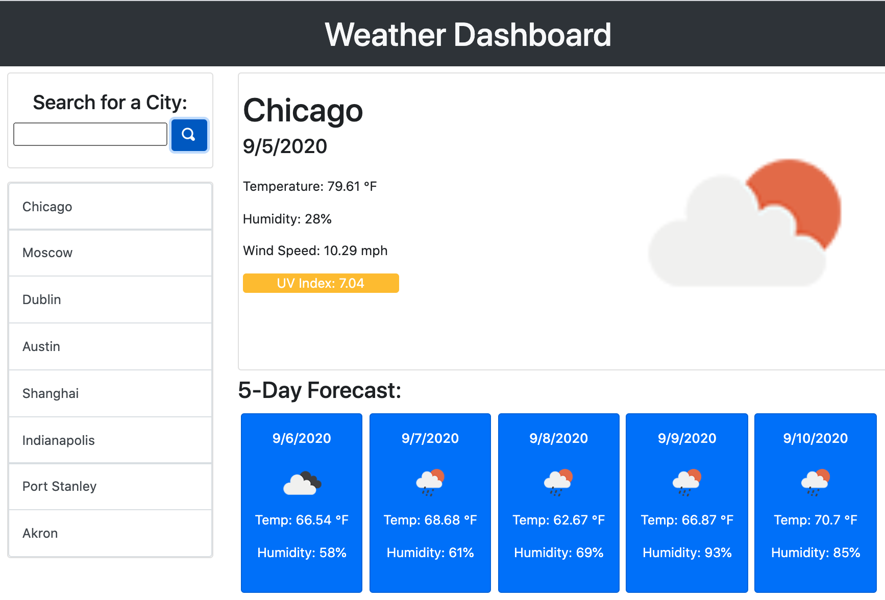

# Weather Dashboard

## Purpose
A web application that provides up-to-date, current weather information as well as a 5-day forecast. Searchable by city, the UI provides informative icons and a clickable search history menu of up to 8 previously searched cities. 

## Built With
* HTML
* CSS
* Bootstrap
* JavaScript
* jQuery
* Open-Iconic API
* OpenWeather API

## Website
https://jeffwjohn.github.io/weather-dashboard/

## Contribution
Made with ❤️ by Jeff Johnston

### ©️2020 Jeff Johnston